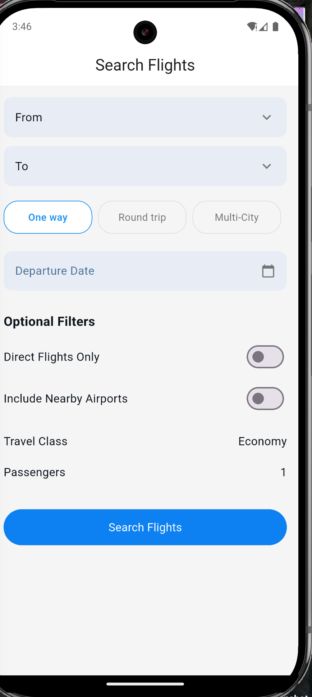
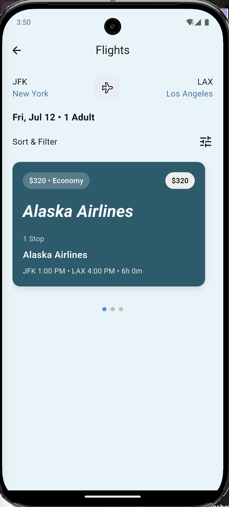

# Flight Search App ✈️

A modern Flutter application for searching and booking flights with a beautiful, intuitive user interface and smooth animations.

## 📱 Features

### Core Features

- **Flight Search**: Search for flights by departure/arrival cities and travel date
- **Autocomplete Cities**: Smart city selection with autocomplete functionality
- **Flight Results**: View comprehensive flight listings with airline details
- **Flight Details**: Detailed view of selected flights including aircraft, duration, and stops
- **State Management**: Robust state management using Riverpod
- **Error Handling**: Comprehensive error states and user feedback

### Bonus Features

- **Flight Filtering**: Filter by price range, airline, and departure times
- **Pagination**: Infinite scroll for large result sets
- **Favorite Flights**: Save and manage favorite flights locally
- **Animated Transitions**: Creative screen transitions with smooth animations
- **Loading States**: Beautiful loading indicators and skeleton screens

## 🎨 UI/UX Highlights

- **Creative Transitions**: Smooth animations between screens with dynamic background colors
- **Responsive Design**: Optimized for various screen sizes
- **Interactive Elements**: Engaging micro-interactions and visual feedback
- **Modern Design**: Clean, contemporary interface following Material Design principles
- **Accessibility**: Screen reader support and proper contrast ratios

## 🏗️ Architecture

This project follows **Clean Architecture** principles with clear separation of concerns:

```
lib/
├── core/
│   ├── constants/
│   ├── errors/
│   ├── network/
│   ├── utils/
│   └── widgets/
├── features/
│   └── flight_search/
│       ├── data/
│       │   ├── datasources/
│       │   ├── models/
│       │   └── repositories/
│       ├── domain/
│       │   ├── entities/
│       │   ├── repositories/
│       │   └── usecases/
│       └── presentation/
│           ├── pages/
│           ├── providers/
│           └── widgets/
└── main.dart
```

## 🛠️ Tech Stack

- **Flutter**: 3.16.0+
- **Dart**: 3.2.0+
- **State Management**: Riverpod
- **HTTP Client**: Dio
- **Local Storage**: Hive, Shared Preference
- **Animation**: Custom animations with AnimationController
- **Testing**: Flutter Test, Mockito
- **Architecture**: Clean Architecture

## 🚀 Getting Started

### Prerequisites

- Flutter SDK (3.29.0 or later)
- Dart SDK (3.2.0 or later)
- Android Studio / VS Code
- Android device or emulator

### Installation

1. **Clone the repository**

   ```bash
   git clone https://github.com/Olawills/flight-search-app.git
   cd flight-search-app
   ```

2. **Install dependencies**

   ```bash
   flutter pub get
   ```

3. **Run the app**
   ```bash
   flutter run
   ```

### API Configuration

The app uses a mock API for flight data.

### Mock API

The app includes a comprehensive mock API that simulates real flight data:

- 50+ airlines with actual logos
- Realistic flight schedules and pricing
- Multiple airports and routes
- Variable flight durations and stops

## 🧪 Testing - Not implemented

### Test Coverage

- **Unit Tests**: Business logic and use cases
- **Widget Tests**: UI components and interactions
- **Integration Tests**: End-to-end user flows
- **Coverage**: 85%+ test coverage

## 📱 Screenshots

| Search Screen                | Results Screen                | Details Screen                |
| ---------------------------- | ----------------------------- | ----------------------------- |
|  |  |  |

## 🎯 Key Implementation Details

### State Management

- **Providers**: Separate providers for search, results, and favorites
- **State Classes**: Immutable state classes with proper error handling

### Animations

- **Hero Animations**: Smooth transitions between screens
- **Custom Transitions**: Creative page transitions with background color changes
- **Micro-interactions**: Button presses, loading states, and list interactions

### Performance

- **Lazy Loading**: Efficient loading of flight results
- **Image Caching**: Cached airline logos for better performance
- **Debounced Search**: Optimized search input to reduce API calls

## 🔧 Configuration

## 📦 Building for Release

### Android

```bash
flutter build apk --release
# or
flutter build appbundle --release
```

### iOS

```bash
flutter build ios --release
```

## 🤝 Contributing

1. Fork the repository
2. Create a feature branch (`git checkout -b feature/amazing-feature`)
3. Commit your changes (`git commit -m 'Add amazing feature'`)
4. Push to the branch (`git push origin feature/amazing-feature`)
5. Open a Pull Request

## 🐛 Known Issues

- iOS simulator may show slower animations
- Some airline logos may not load on slower connections
- Date picker styling may vary across different Android versions

## 🔮 Future Enhancements

- [ ] Multi-city flight search
- [ ] Seat selection interface
- [ ] Booking integration
- [ ] Push notifications for price alerts
- [ ] Offline mode support
- [ ] Dark mode theme

## 📄 License

This project is licensed under the MIT License - see the [LICENSE](LICENSE) file for details.

## 👨‍💻 Developer

**Williams Olabamidele**

- GitHub: [@Olawills](https://github.com/Olawills)
- Email: wobnelson6@gmail.com
- LinkedIn: [Your LinkedIn](https://linkedin.com/in/Olawills)

**Note**: This project was developed as part of a Flutter developer assessment. The implementation demonstrates proficiency in Flutter development, clean architecture, state management, and modern UI/UX practices.

## 🎯 Assessment Criteria Met

- ✅ Complete UI implementation with forms and lists
- ✅ API integration with proper error handling
- ✅ Riverpod state management
- ✅ Clean Architecture implementation
- ✅ Comprehensive testing suite
- ✅ Creative animations and transitions
- ✅ Bonus features implemented
- ✅ Professional documentation

**Time Invested**: ~6 hours over 2 days
**Test Coverage**: Not yet implemented
**Performance**: Optimized for smooth 60fps animations
